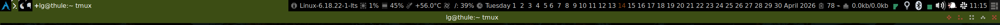

# Awesome 4.x archKiss

This is my theme and configuration file for Awesome 4.x WM inspired by Archlinux dark colors and KISS (Keep it simple stupid) philosophy. 
It uses icons from other [great awesome themes](https://github.com/mikar/awesome-themes) (see credits for details).
I'm using it with ~~GTK adawaita dark theme~~ [Flat-Remix-Darkest](https://drasite.com/flat-remix-gtk) available for GTK 3 and GTK 2.
Recently I introduced some great ideas from [awesome-copycats](https://github.com/lcpz/awesome-copycats).

## Configuration

I have some variables to control what to show in the panel bar on top, you can customize as you wish.
I have also some variables to control what default applications to use. In the configuration the default applications labels are used instead of program name,
e.g. browser instead of Chromium, so it remains quite solid.
By beautiful you can choose between three themes:
* theme_grey.lua: inspired on default awesome colors
* theme_dark.lua: a mix between awesome default colors and Archlinux colors
* theme_arch.lua: inspired by Archlinux colors
* theme_nature.lua: inspired by nature colors

```lua
-- Themes define colours, icons, and wallpapers
beautiful.init("/home/lg/.config/awesome/themes/kiss/theme_nature.lua")

-- User / hostname info
user_hostname = true

-- Kernel version monitoring
kernel_mon = true

-- Uptime
uptime = true

-- Nic interfaces to monitor, fifo
nics = {"enp0s31f6", "wlp1s0"}

-- Maildir monitor, false or maildir location
mail_mon = false

-- Switch to enable hwmonitor
hwmonitor = true

-- Switch to enable battery monitoring
laptop = true

-- Mountpoint(s) to monitor
mounts = " /: ${/ used_p}%"

-- Enable full calendar on 2nd monitor
full_cal = true

-- Enable mpd bar
mpd = true

-- Enable spotify bar
spotify = true

-- This is used later as the default applications to run.
terminal = "urxvt"
browser = "firefox"
editor = "gvim"
email = terminal .. " -e neomutt"
email_gui = "thunderbird"
pad = "leafpad"
pim = terminal .. " -title pim -e tmuxp load pim"
news = terminal .. " -title news -e tmuxp load news"
note = terminal .. " -title note -e tmuxp load note"
filemanager = terminal .. " -e ranger"
filemanager_gui = "thunar"
task = "lxtask"
im = "pidgin"
irc = terminal .. " -title irc -e weechat"
teams = "teams"
slack = "slack"
music = terminal .. " -e ncmpcpp"
music_toggle = "mpc toggle"
music_stream = "spotify"
music_stream_toggle = "sp play"
music_stream_data = "sp current-oneline"
media = "mpv"
password = "rofi-pass"
clipboard = "rofi -modi \"paste:~/bin/paste-modi.sh\" -show paste"
vm = "virtualbox"
remote = "remmina"
runner = "rofi -show run"
wswitcher = "rofi -show window"
bright_down = "xbacklight -dec 10"
bright_up = "xbacklight -inc 10"
audio_toggle = "mpc toggle"
audio_up = "amixer -D pulse sset Master 2%+"
audio_down = "amixer -D pulse sset Master 2%-"
lock = "i3lock-fancy"
poweroff = "sudo poweroff"
reboot = "sudo reboot"

```

## Screenshot

* theme_grey

* theme_dark

* theme_arch

* theme_nature


## Credits
* Taglists squares: dust awesome theme by tdy
* Titlebar icons: zenburn awesome theme by Adrian C. (anrxc), [copland and dremora awesome theme by icpz](https://github.com/lcpz/awesome-copycats)
* Layout icons: grey-new awesome theme by Andreas Persson (greyscale, grey), [copland and dremora awesome theme by icpz](https://github.com/lcpz/awesome-copycats)
* Widget icons: sunjack awesome theme by ?
* Screenshoot wallpaper: [Archlinux wallpaper by giancarlo64](https://www.deviantart.com/giancarlo64/art/ArchLinux-Wallpaper-360078960)
